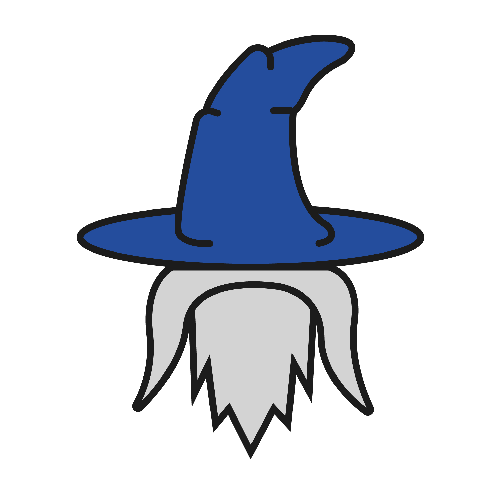

# Merlin

<p align="center"></p>

Merlin is a platform for deploying and serving machine learning models. The project was born of the belief that model deployment should be:

* **Easy and self-serve**: Human should not become the bottleneck for deploying model into production.
* **Scalable**: The model deployed should be able to handle Gojek scale and beyond.
* **Fast**: The framework should be able to let user iterate quickly.
* **Cost efficient**: It should provide all benefit above in a cost efficient manner.

Merlin attempts to do so by:

* **Abstracting infrastructure**: Merlin uses familiar concept such as Project, Model, Version, and Endpoint as its core component and abstract away complexity of deploying and serving ML service from user.
* **Autoscaling**: Merlin is built on top Knative and KFServing to provide a production ready serverless solution.

## Getting Started

### Local Development

Requirements:

1. Golang 1.13
1. NPM LTS
1. Python 3
1. Docker
1. [Swagger Codegen 2.X](https://github.com/swagger-api/swagger-codegen)

## Documentation

Go to the [docs](/docs) folder for the full documentation, examples and guides.

### API Documentation

To explore the API documentation, run:

```bash
make swagger-ui
```

## Client Libraries

We use [Swagger Codegen](https://github.com/swagger-api/swagger-codegen) to automatically generate Golang and Python clients for Merlin API. To genarate the client libraries, run:

```bash
make generate-client
```
