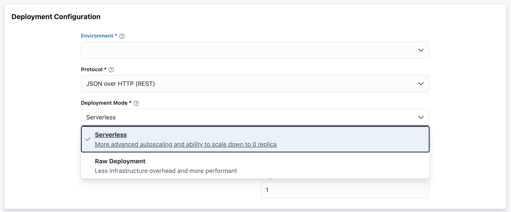

## Autoscaling Policy

Merlin supports configuratble autoscaling policy to ensure that user has complete control over the autoscaling behavior of their models. 
There are 4 types of autoscaling metrics in Merlin:

#### CPU utilization

The autoscaling is based on the ration of model service's CPU usage and its CPU request. This autoscaling policy is available on all deployment mode. 

#### Memory utilization

The autoscaling is based on the ration of model service's Memory usage and its Memory request. This autoscaling policy is available only on `SERVERLESS` deployment mode.

#### Model Throughput (RPS)

The autoscaling is based on RPS per replica of the model service. This autoscaling policy is available only on `SERVERLESS` deployment mode.

#### Concurrency

The autoscaling is based on number of concurrent request served by a replica of the model service. This autoscaling policy is available only on `SERVERLESS` deployment mode.


## Configuring Autoscaling Policy

User can update autoscaling policy via Merlin SDK and Merlin UI

### Configuring Autoscaling Policy via SDK

Below is the example of configuring autoscaling policy of a `SERVERLESS` deployment to use `RPS` metrics.

```python
import merlin
from merlin import DeploymentMode
from merlin.model import ModelType

# Deploy using raw_deployment
merlin.set_url("http://localhost:5000")
merlin.set_project("my-project")
merlin.set_model("my-model", ModelType.TENSORFLOW)
model_dir = "test/tensorflow-model"

with merlin.new_model_version() as v:
    merlin.log_model(model_dir=model_dir)

# Deploy using raw_deployment
    endpoint = merlin.deploy(v1, deployment_mode=DeploymentMode.SERVERLESS,
                            autoscaling_policy=merlin.AutoscalingPolicy(
                                metrics_type=merlin.MetricsType.RPS,
                                target_value=20))
```

### Configuring Autoscaling Policy via UI

[](https://user-images.githubusercontent.com/4023015/159232744-8aa23a87-9609-4825-9cb8-4bf0a7c0e4e1.mov)
