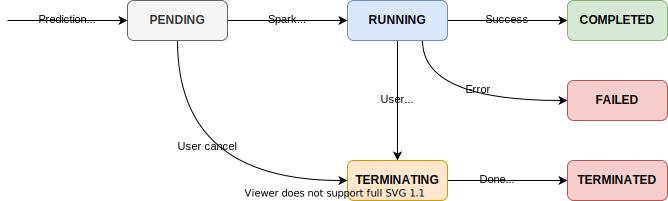

# Batch Prediction

The batch prediction job will be executed as a Spark Application running in a Spark cluster on top of Kubernetes.

## Prediction Job

Prediction Job is the resource introduced in Merlin for executing batch prediction. A Prediction Job is owned by the corresponding [Model Version](./model_version.md). One Model Version can have several Prediction Jobs and it maintains the history of all jobs ever created. Prediction Job has several important properties:

1. **Id**: Unique ID of the prediction job
1. **Model / Model version**: Reference to the model version from which the prediction job is created
1. **Config**: config will contain the source, sink, secret configuration of the prediction job. It could also contain additional config for resource requests or spark-specific configuration
1. **State**: Current state of the prediction job (see lifecycle section)
1. **Error**: Detailed error message if the prediction job is unsuccessful
1. **Logs**: Link to the log location
1. **Monitoring URL**: Link to the monitoring dashboard

## Lifecycle

Prediction Job has several state during its lifetime:

1. **Pending**: Prediction job is in this state once it is created / submitted. It will enter the running state if the spark application is started successfully, otherwise it will enter a failed state.
1. **Running**: Prediction jobs will move to the running state once the underlying spark application for executing the prediction job is created. The prediction job will be in this state until the spark application is completed (in which case it moves to completed state) or failed (in which case the prediction job entered failed state). Users can manually stop the prediction job and it will enter the terminating state.
1. **Completed**: Prediction job enter the completed state if it’s completed successfully
1. **Failed**: Any kind of failure preventing the prediction job not being able to complete will make it enters the failed state.
1. **Terminating**: Prediction jobs enter a terminating state if a user manually cancels a pending/running prediction job.
1. **Terminated**: Once the termination process is completed the prediction job will enter the terminated state.



## Creating Secret/Service Account

To be able to run a Prediction Job you’ll need a service account and store the key inside the MLP Project using secret management API. The service account must have following authorization:

1. BigQuery Job User (`roles/bigquery.jobUser`) in the project where service account is created
1. BigQuery Read Session User (`roles/bigquery.readSessionUser`) in the project where service account is created
1. BigQuery Data Viewer (`roles/bigquery.dataViewer`) in the source dataset
1. BigQuery Data Editor (`roles/bigquery.dataEditor`) in the destination dataset
1. Storage Writer (`roles/storage.legacyBucketWriter`)
1. Storage Object Admin (`roles/storage.objectAdmin`)

## Configuring Source

You can specify the source configuration of your prediction job by creating an instance of `BigQuerySource`. This class’s constructor accept following parameters:

1. `table`: source table ID with format gcp_project.dataset_name.table_name
1. `features`: list of features to be used for prediction, it has to match the column name in the source table.
1. `options`: is dictionary containing additional options that could be used to customize the source. Following are option that can be used.

| Property                     | Description                                                                                                                                                                                                                                                                                                                                                                                                                                                                                                                                                |
| ---------------------------- | ---------------------------------------------------------------------------------------------------------------------------------------------------------------------------------------------------------------------------------------------------------------------------------------------------------------------------------------------------------------------------------------------------------------------------------------------------------------------------------------------------------------------------------------------------------- |
| `parentProject`              | The Google Cloud Project ID of the table to bill for the export.(Optional. Defaults to the project of the Service Account being used)                                                                                                                                                                                                                                                                                                                                                                                                                      |
| `maxParallelism`             | The maximal number of partitions to split the data into. Actual number may be less if BigQuery deems the data small enough. If there are not enough executors to schedule a reader per partition, some partitions may be empty. **Important**: The old parameter (`parallelism`) is still supported but in deprecated mode. It will ve removed in version 1.0 of the connector. (Optional. Defaults to one partition per 400MB. See [Configuring Partitioning](https://github.com/GoogleCloudDataproc/spark-bigquery-connector#configuring-partitioning).) |
| `viewsEnabled`               | Enables the connector to read from views and not only tables. Please read the [relevant section](https://github.com/GoogleCloudDataproc/spark-bigquery-connector#reading-from-views) before activating this option.(Optional. Defaults to `false`)                                                                                                                                                                                                                                                                                                         |
| `viewMaterializationProject` | The project id where the materialized view is going to be created(Optional. Defaults to view's project id)                                                                                                                                                                                                                                                                                                                                                                                                                                                 |
| `viewMaterializationDataset` | The dataset where the materialized view is going to be created(Optional. Defaults to view's dataset)                                                                                                                                                                                                                                                                                                                                                                                                                                                       |
| `readDataFormat`             | Data Format for reading from BigQuery. Options: `ARROW`, `AVRO`. Unsupported Arrow filters are not pushed down and results are filtered later by Spark. (Currently Arrow does not suport disjunction across columns).(Optional. Defaults to `AVRO`)                                                                                                                                                                                                                                                                                                        |
| `optimizedEmptyProjection`   | The connector uses an optimized empty projection (select without any columns) logic, used for count() execution. This logic takes the data directly from the table metadata or performs a much efficient `SELECT COUNT(*) WHERE...` in case there is a filter. You can cancel the use of this logic by setting this option to `false`. (Optional, defaults to `true`)                                                                                                                                                                                     |

Source: https://github.com/GoogleCloudDataproc/spark-bigquery-connector

### Reading from View

To use view as data source instead of table you’ll have to set viewsEnabled to true and specify `viewMaterializationProject` and `viewMaterializationDataset`. Since the materialization of view will create a table, the service account should also have `roles/bigquery.dataEditor` in the pointed dataset. Below is an example:

```python
bq_source = BigQuerySource("project.dataset.table_iris",
    features=["sepal_length", "sepal_width", "petal_length", "petal_width"],
    options={
        "viewsEnabled" : "true",
        "viewMaterializationProject" : "project",
        "viewMaterializationDataset" : "dsp"
    })
```

## Configuring Sink

To configure the destination of prediction job you can create an instance of `BigQuerySink`. The class accepts following parameters:

1. `table`: destination table ID with format gcp_project.dataset_name.table_name
1. `staging_bucket`: GCS staging bucket that will be used as temporary storage for storing prediction result before loading it to the destination table.
1. `result_column`: Column name in the destination table that will be used to store the prediction result. Note that it has to be a string and not list of string even though if you specify ARRAY as the result.
1. `save_mode`: SaveMode is used to specify the expected behavior of saving the prediction result into destination table. Following are the possible values:
   - `ERRORIFEXISTS`: it will throw error if the destination table already exists (default).
   - `OVERWRITE`: it will overwrite the destination table if it exists.
   - `APPEND`: it will append the new result into destination table if it exists.
   - `IGNORE`: it will not write the prediction result if the destination table exists.
1. `options`: Dictionary of strings that can be used to specify additional configuration. Following are the available parameters.

| Property                | Description                                                                                                                                                                                                                                                                                                                                                                                                                   |
| ----------------------- | ----------------------------------------------------------------------------------------------------------------------------------------------------------------------------------------------------------------------------------------------------------------------------------------------------------------------------------------------------------------------------------------------------------------------------- |
| `createDisposition`     | Specifies whether the job is allowed to create new tables. The permitted values are: <ol><li>`CREATE_IF_NEEDED` - Configures the job to create the table if it does not exist.</li><li>`CREATE_NEVER` - Configures the job to fail if the table does not exist.</li></ol> This option takes place only in case Spark has decided to write data to the table based on the SaveMode. (Optional. Default to `CREATE_IF_NEEDED`). |
| `intermediateFormat`    | The format of the data before it is loaded to BigQuery, values can be either "parquet" or "orc". (Optional. Defaults to `parquet`). On write only.                                                                                                                                                                                                                                                                            |
| `partitionField`        | If not set, the table is partitioned by pseudo column, referenced via either `'_PARTITIONTIME' as TIMESTAMP` type, or `'_PARTITIONDATE' as DATE` type. If field is specified, the table is instead partitioned by this field. The field must be a top-level TIMESTAMP or DATE field. Its mode must be **NULLABLE** or **REQUIRED**. (Optional).                                                                               |
| `partitionExpirationMs` | Number of milliseconds for which to keep the storage for partitions in the table. The storage in a partition will have an expiration time of its partition time plus this value. (Optional).                                                                                                                                                                                                                                  |
| `partitionType`         | The only type supported is `DAY`, which will generate one partition per day. (Optional. Default to `DAY`).                                                                                                                                                                                                                                                                                                                    |
| `clusteredFields`       | Comma separated list of non-repeated, top level columns. Clustering is only supported for partitioned tables (Optional).                                                                                                                                                                                                                                                                                                      |
| `allowFieldAddition`    | Adds the [ALLOW_FIELD_ADDITION](https://googleapis.dev/java/google-cloud-clients/latest/com/google/cloud/bigquery/JobInfo.SchemaUpdateOption.html#ALLOW_FIELD_ADDITION) SchemaUpdateOption to the BigQuery LoadJob. Allowed vales are `true` and `false`. (Optional. Default to `false`).                                                                                                                                     |
| `allowFieldRelaxation`  | Adds the ALLOW_FIELD_RELAXATION SchemaUpdateOption to the BigQuery LoadJob. Allowed vales are `true` and `false`. (Optional. Default to `false`).                                                                                                                                                                                                                                                                             |

Source: https://github.com/GoogleCloudDataproc/spark-bigquery-connector

## Configuring Resource Request

Class `PredictionJobResourceRequest` is useful to configure the resource request for running prediction job. Following are the parameters that can be configured:

1. `driver_cpu_request` : Driver CPU request. e.g: 1, 1500m , 500m
1. `driver_memory_request`: Driver memory request. e.g. 1Gi, 512Mi
1. `executor_cpu_request`: executor CPU request. e.g: 1, 1500m , 500m
1. `executor_memory_request`: executor memory request. e.g. 1Gi, 512Mi
1. `executor_replica`: number of executor replica. e.g. 1, 2

Without specifying `PredictionJobResourceRequest` the prediction job will run with the system default as follow:

```
executor_replica: 3
driver_cpu_request: "2"
driver_memory_request: "2Gi"
executor_cpu_request: "2"
executor_memory_request: "2Gi"
```

This default configuration is good enough for most cases. However, it might not be sufficient for case where you have large model size , the dataset has a wide table (a lot of column), or the processing requires a lot of memory. In such case you might want to increase the `executor_memory_request` to a larger value. The best value can be determined by observing the memory usage of the executor in the monitoring dashboard.

You might also want to make the prediction job to complete faster by increasing the `executor_cpu_request` and `executor_replica`. However, **it will increase the cost significantly**.

## Known Issues

### Type Conversion Error When BQ Source Has Date Column

#### Symptom

Following error is thrown during batch prediction execution

```
>       raise AttributeError("Can only use .dt accessor with datetimelike "
                             "values")
E       AttributeError: Can only use .dt accessor with datetimelike values

../../../.local/share/virtualenvs/merlin-pyspark-n4ybPFnE/lib/python3.7/site-packages/pandas/core/indexes/accessors.py:324: AttributeError

Assertion failed
```

Check whether your BQ source table has DATE type column. If so the workaround might help.

#### Root Cause

https://issues.apache.org/jira/browse/SPARK-30961

#### Work Around

Add `pyarrow==0.11.1` and `pandas==0.24.1` to conda `environment.yaml` of your model.
