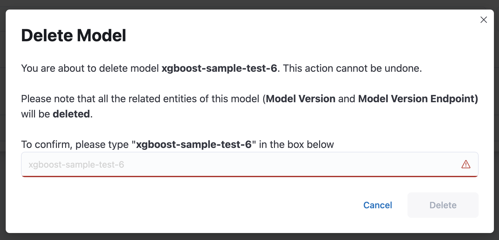

# Model Deletion

A Merlin model can be deleted only if it is not serving any endpoints, does not have any deployed model versions, or, if the model has the `pyfunc_v2` type, the model version must not have any active prediction jobs. Deleting a model will result in purging all the model versions associated with it, as well as related entities such as endpoints or prediction jobs (applicable for models with the `pyfunc_v2` type) from the Merlin databaseThis action is **irreversible**.

If there are any model version that contain any active prediction jobs or endpoints on the related model, the deletion will be prohibited.


## Model Deletion Via SDK
```python
merlin.set_project("test-project")

merlin.set_model('test-model')

model = merlin.active_model()

model.delete_model()
```

## Model Deletion via UI
To delete a model from the UI, you can access the delete button directly on the model list page. The dialog will provide information about how many entities that are blocking the deletion process.

If the model does not have any entities, it will show this dialog


If the model does have active entities, it will show this dialog

