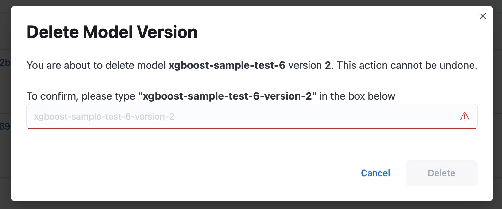
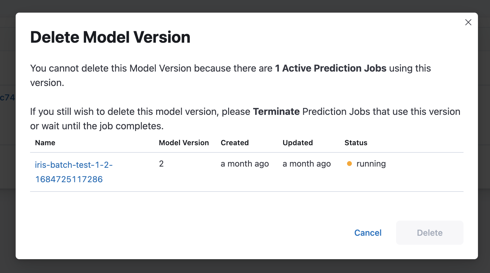

# Model Version Deletion

A Merlin model version can be deleted only if it is not serving any endpoints, does not have any deployed endpoints, or if the model has the `pyfunc_v2` type, the model version must not have any active prediction jobs. Deleting a model version will result in purging the model version and its related entities, such as endpoints or prediction jobs, from the Merlin database. This action is **irreversible**.

If there are any active prediction jobs or endpoints on the related model, the deletion will be prohibited.

## Model Version Deletion Via SDK
To delete Model Version, you can call `delete_model_version()` function from Merlin Python SDK.

```python
merlin.set_project("test-project")

merlin.set_model('test-model')

version = merlin.active_model().get_version(id_version)

version.delete_model_version()
```


## Model Version Deletion via UI
To delete a model version from the UI, you can access the delete button directly on the model version list page. The dialog will provide information about entities that are blocking the deletion process or will be deleted along with the model version.

If the model version does not have any entities, it will show this dialog 


If the model version does have active entities, it will show this dialog (showing which entities block the deletion process)


If the model version does have inactive entities, it will show this dialog (showing which entities will get deleted along with the deletion process)

