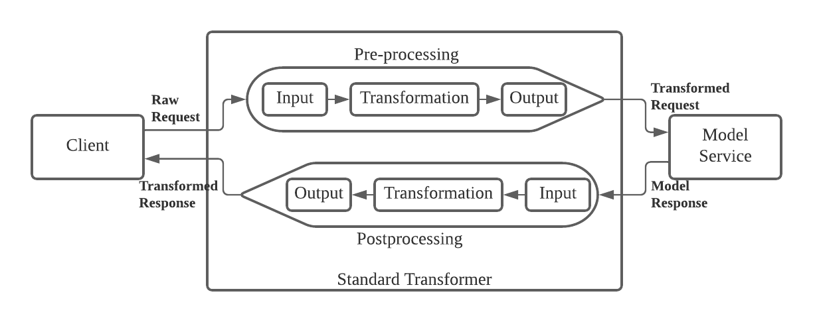

# Standard Transformer 
Standard Transformer is a built-in pre and post-processing steps supported by Merlin. With standard transformer, it’s possible to enrich the model’s incoming request with features from feast and transform the payload so that it’s compatible with API interface provided by the model. Same transformation can also be applied against the model’s response payload in the post-processing step, which allow users to adapt the response payload to make it suitable for consumption. 


## Concept

Within standard transformer there are 2 process that user can specify: preprocess and postprocess. 

Preprocess  is useful to perform transformation against model’s incoming request such as enriching the request with features from Feast and transforming the client’s request to a format accepted by model service. 

Post Processing is useful for performing transformation against model response so that it is more suitable for client consumption.

Within both preprocess and postprocess, there are 3 stages that users can specify:

* Input stage
  In the input stage, users specify all the data dependencies that are going to be used in subsequent stages. There are 2 operations available in these stages: variable declaration and table creation. 

* Transformation stage.
  In this stage, the standard transformers perform transformation to the tables created in the input stage so that its structure is suitable for the output. In the transformation stage, users operate mainly on tables and are provided with 2 transformation types: single table transformation and table join.


* Output stage
  At this stage, both the preprocessing and postprocessing pipeline should create a JSON output. The JSON output of preprocessing pipeline will be used as the request payload to be sent as model request, whereas JSON output of the postprocessing pipeline will be used as response payload to be returned to downstream service / client.


<p align="center"></p>

## Jsonpath
Jsonpath is a way to find value from JSON payload. Standard transformer using jsonpath to find values either from request or model response payload. Standard transformer using Jsonpath in several operations:
* Variable declaration
* Feast entity value
* Base table
* Column value in table
* Json Output


Most of the jsonpath configuration is like this 
```
fromJson:

    jsonPath:       # Json path in the incoming request / model response payload

    defaultValue:   # (Optional) Default value if value for the jsonPath is nil or empty 

    valueType:      # Type of default value, mandatory to specify if default value is exist

```

but in some part of operation like variable operation and feast entity extraction, jsonPath configuration is like below

```
    jsonPathConfig:

        jsonPath:       # Json path in the incoming request / model response payload

        defaultValue:   # (Optional) Default value if value for the jsonPath is nil or empty 

        valueType:      # Type of default value, mandatory to specify if default value is exist

```

### Default Value

In standard transformer, user can specify jsonpath with default value if the result of jsonpath is empty or nil. Cases when default value is used:
* Result of jsonpath is nil
* Result of jsonpath is empty array
* Result of jsonpath is array, where some of its value is null

Value Type

|Value Type| Syntax      |
|----------| ------------|
| Integer  | INT         |
| Float    | FLOAT       |
| Boolean  | BOOL        |
| String   | STRING      |

For example, if we have incoming request 
```
{
  "signature_name" : "predict",
  "instances": [
	{"sepal_length":2.8, "sepal_width":1.0, "petal_length":6.8, "petal_width":0.4},
	{"sepal_length":0.1, "sepal_width":0.5, "petal_length":1.8, "petal_width":2.4}
  ],
  "instances_with_null": [
	{"sepal_length":2.8, "sepal_width":1.0, "petal_length":6.8, "petal_width":0.4},
	{"sepal_length":0.1, "sepal_width":0.5, "petal_length":1.8, "petal_width":null},
          {"sepal_length":0.1, "sepal_width":0.5, "petal_length":1.8, "petal_width":0.5}
  ],
  "empty_array": [],
  "null_key": null,
  "array_object": [
	  {"exist_key":1},
	  {"exist_key":2}
  ]
}
```

* Result of jsonpath is nil
  There are cases when `jsonpath` value is nil:
  * Value in JSON is nil
  * There is no such key in JSON

Example:
  ```
    fromJson:
        jsonPath: $.null_key
        defaultValue: -1
        valueType: INT
  ```
  the result of above Jsonpath is `-1` because `$.null_key` returning nil
* Result of jsonpath is empty array
  ```
    fromJson:
        jsonPath: $.empty_array
        defaultValue: 0.0
        valueType: FLOAT
  ```
  the result of above Jsonpath is `[0.0]` because `$.empty_array` returning empty so it will use default value 
* Result of jsonpath is array, where some of its value is null
  ```
    fromJson:
        jsonPath: $.instances_with_null[*].petal_width
        defaultValue: -1
        valueType: INT
  ```
  the result of above Jsonpath is `[0.4,-1,0.5]`, because the original jsonpath result `[0.4,null,0.5]` containing null value, the default value is used to replace `null` value

## Expression

An expression is a single line of code which should return a value. Standard transformer uses expression as a flexible way of calculating values to be used in variable initialization or any other operations. 

For example:

Expression can be used for initialising variable value

```
variables:
  - currentTime:
      expression: now() 
  - currentHour:
      expression: currentTime.Hour() 
```
Expression can be used for updating column value
```
 updateColumns:
    column: "s2id"
    expression: getS2ID(df.Col('lat'), df.Col('lon'))
```

For full list of standard transformer built-in function, please check [Transformer Expressions](./transformer_expressions.md).

## Input Stage
At the input stage, users specify all the data dependencies that are going to be used in subsequent stages. There are 3 operations available in these stages: 

1. Table creation 
- Table Creation from Feast Features
- Table Creation from Input Request
- Table Creation from File

2. Variable declaration

3. Encoder declaration

### Table Creation
Table is the main data structure within the standard transformer. There are 3 ways of creating table in standard transformer: 

#### Table Creation from Feast Features
This operation creates one or more tables containing features from Feast. This operation is already supported in Merlin 0.10. The key change to be made is to adapt the result of operation. Previously, the features retrieved from feast is directly enriched to the original request body to be sent to the model. Now, the operation only outputs as internal table representation which can be accessible by subsequent transformation steps in the pipeline. 

Additionally, it should be possible for users to give the features table a name to ease referencing the table from subsequent steps. 

Following is the syntax:  

   ```
    feast:
        - tableName:       # Specify the output table name
  
          project:          # Name of project in feast where the features located
  
          source:           # Source for feast (REDIS or BIGTABLE)
  
          entities:        # List of entities
  
            - name:          # Entity Id
  
              valueType:     # Entity Value Type
             
              # The entity value will be retrieved either using jsonPath or expression configuration below:  
              jsonPathConfig: 
  
                jsonPath:       # Json path in the incoming request container the entity value
  
                defaultValue:   # (Optional) Default value if value for the jsonPath is nil or empty 
  
                valueType:      # Type of default value, mandatory to specify if default value is exist
  
              jsonPath:      # Json path in the incoming request containing the entity value (Deprecated)
  
              expression:    # Expression provided by user which return entity values
  
          features:        # List of features to be retrieved
  
            - name:          # feature name
  
              defaultValue:  # default value if the feature is not available
  ```
  below is the sample of feast input:

  ```
    feast:
          - tableName: table_1
            project: sample
            source: BIGTABLE
            entities:
              - name: merchant_uuid
                valueType: STRING
                jsonPathConfig:
                    jsonPath: $.merchant_uuid
                    defaultValue: -1
                    valueType: INT
              - name: customer_id
                valueType: STRING
                expression: customer_id
            features:
              - name: sample_driver:order_count
                valueType: DOUBLE
                defaultValue: '90909'
  ```

  There are two ways to get/retrieve features from feast in merlin standard transformer:
    * Getting the features values from feast GRPC URL
    * By direcly querying from feast storage (Bigtable or Redis). For this, you need to add extra environment variables in standard transformer
      * REDIS. Set `FEAST_REDIS_DIRECT_STORAGE_ENABLED` value to true
      * BIGTABLE. Set `FEAST_BIGTABLE_DIRECT_STORAGE_ENABLED` value to true
  
  \
  For detail explanation of environment variables in standard transformer, you can look [this section](#standard-transformer-environment-variables)

  #### Table Creation from Input Request
  This step is generic table creation that allows users to define one or more tables based on value from either JSON payload, result of built-in expressions, or an existing table. Following is the syntax for table input:
  ```
    tables:
  
        - name:         # Table name
  
          baseTable:         # create a base table either from a JSON array of object or from existing table
  
            fromJson:        # create a table based on an array of objects within JSON payload, the object key will be column name.
  
                jsonPath:       # JSONPath to array of object in the JSON payload
  
                defaultValue:   # Fallback value if value for jsonpath is nil or empty   
  
                addRowNumber:   # True/false, add column called "row_number" which contains row number
  
            fromTable:       # Create base table from an existing table
  
                tableName:     # Source table name
  
            columns:          # List of columns to be added in the table, it's possible to have 0 columns. The columns will override existing column defined in the baseTable
  
                            # The number of row in the first column determines the table size so put the longest column first
  
                - name:           # Column name
  
                  fromJson:        # Get column values from json path
  
                    jsonPath:       # JSONPath to array of object in the JSON payload
  
                    defaultValue:   # Fallback value if value for jsonpath is nil or empty    
  
                  expression:      # Assign result from expression to the column value
  
  ```
  sample:

  ```
    - tables:
          - name: table_2
            baseTable:
              fromTable:
                tableName: table_1
            columns:
              - name: col_1
                fromJson:
                    jsonPath: $.drivers[*].id
              - name: col_2
                expression: table.Col('rating')
          - name: table_3
            baseTable:
              fromJson:
                jsonPath: $.drivers[*]
            columns:
              - name: col_1
                fromJson:
                    jsonPath: $.drivers[*].id
              - name: col_2
                expression: table.Col('rating')
  
  ```

#### Table Creation from File
This operation allows user to create a static table from a file. For example, user might choose to load a table with a list of public holidays for the year. As the data will be loaded into memory, it is strongly advised to keep the total size of all files within 50mb. Also, each file shall only contain information for 1 table.

##### Supported File Format

There are 2 types of files are currently supported: 

- csv: For this file type, only comma (,) may be used as delimiter. The first line shall also contain a header, which gives each column a unique name.

- parquet

##### Supported File Storage Location

Currently, files must first be uploaded to a preferred GCS bucket in gods-* project. The file will be read once during deployment.

##### Supported Column Types

Only basic types for the columns are supported, namely: String, Integer, Float and Boolean

The types of each column are auto-detected, but may be manually set by the user (please ensure type compatibility). 

##### How to use

In order to use this feature, firstly, these files will have to be loaded into GCS buckets in gods-* projects in order to be linked.

Then, use the syntax below to define the specifications:

    ```
    tables:
    - name:     # Table name  
      baseTable:      
        fromFile:
          format: CSV    # others: PARQUET
          uri:  # GCS uri to the location of the file in gods-* project
          schema:   # this part is used to manually set column type
          - name: col_1        # name of column
            type: STRING     #others: INT, FLOAT, BOOL
    …         
          - name: col_2
            type: INT
    ```


### Variable
Variable declaration is used for assigning literal value or result of a function into a variable. The variable declaration will be executed from top to bottom and it’s possible to refer to the declared variable in subsequent variable declarations. Following are ways to set value to variable.

* Literal
  Specifiying literal value to variable. By specifying literal values user needs to specify what is the type for that variable. Types that supported for this:
    * String
    * Int
    * Float
    * Bool
  for example:
  ```
    - variables:
        - name: var_1
          literal:
            intValue: 3
        - name: var_2
          literal:
            floatValue: 2.2
        - name: var_3
          literal:
            boolValue: true
        - name: var_4
          literal:
            stringValue: stringVal
  
  ```
* Jsonpath
  Value of variable is obtained from request/model response payload by specifying jsonpath value, e.g
  ```
    - variables:
        - name: var_5
          jsonPathConfig: 
            jsonPath: $.rating
            defaultValue: -1
            valueType: INT
        - name: var_6
          jsonPath: $rating # deprecated
  ```
* Expression
  Value of variable is obtained from expression, e.g
  ```
    - variables:
        - name: var_7
          jsonPathConfig:
            jsonPath: $.customer_id
        - name: var_8
          expression: var_7
  ```

### Encoders
In order to encode data in the transformation stage, we need to first define an encoder by giving it a name, and defining the associated configurations.

The syntax of encoder declaration is as follows:
```
- encoders: 

    - name:           #name of encoder 1

      <encoder 1 specs>

    - name:          #name of encoder 2

      <encoder 2 specs>
```

There are 2 types of encoder currently available: 

Ordinal encoder: For mapping column values from one type to another

Cyclical encoder: For mapping column values that have a cyclical significance.  For example, Wind directions, time of day, days of week

#### Ordinal Encoder Specification
The syntax to define an ordinal encoder is as follows:

```
ordinalEncoderConfig: 

  defaultValue:         #default value

  targetValueType:      #target value type. i.e. INT, FLOAT, BOOL or STRING

  mapping: 

    <mapping value 1>

    …

    <mapping value n>
```

There are currently 4 types of target value supported. The following table shows the syntax to use for each type:

|Value Type| Syntax      |
|----------| ------------|
| Integer  | INT         |
| Float    | FLOAT       |
| Boolean  | BOOL        |
| String   | STRING      |

See below for a complete example on how to declare an ordinal encoder

```
- encoders: 
    - name: vehicle_mapping 
      ordinalEncoderConfig: 
          defaultValue: '0' 
          targetValueType: INT 
          mapping: 
            suv: '1' 
            sedan: '2'
```

#### Cyclical Encoder Specification
Cyclical encoder are useful for encoding columns that has cyclical significance. By encoding such columns cyclically, you can ensure that the values representing the end of a cycle and the start of the next cycle does not jump abruptly. Some examples of such data are:

- Hours of the day
- Days of the week
- Months in a year
- Wind direction
- Seasons
- Navigation Directions

The syntax to define an cyclical encoder is as follows:
```
cyclicalEncoderConfig:
  <Encode By>
```

There are 2 ways to encode the column:

1. By epoch time: Unix Epoch time is the number of seconds that have elapsed since January 1, 1970 (midnight UTC/GMT). By using this option, we assume that the time zone to encode in will be UTC. In order to use this option you only need to define the period of your cycle to encode.

1. By range: This defines the base range of floating point values representing a cycle. For example, one might define wind directions to be in the range of 0 to 360 degrees, although the actual value may be >360 or <0.

To encode by **epoch time**, use the following syntax:
```
cyclicalEncoderConfig:
  byEpochTime:
    periodType: HOUR #HOUR, DAY, WEEK, MONTH, QUARTER, HALF, YEAR
```

Period type defines the time period of a cycle. For example, HOUR means that a new cycle begins every hour and DAY means that a new cycle begins every day.

***NOTE: If you choose to encode by epoch time, the granularity is per seconds. If you need different granularity, you can modify the values in the epoch time column accordingly or choose to encode by range.***

To encode by **range**, use the following syntax:
```
cyclicalEncoderConfig:
  byRange:
    min: FLOAT
    max: FLOAT
```
Do note that the min and max values are Float. The range is inclusive for the min and exclusive for the max, since in a cycle min and max will represent the same phase. For example, you can encode the days of a week in the range of [1, 8), where 8 and 1 both represents the starting point of a cycle. You can then represent Monday 12am as 1 and Sunday 12pm as 7.5 and so on.

See below for complete examples on how to declare a cyclical encoder:

*By epoch time:*
```
-encoders: 
  -name: payday_trend
   cyclicalEncoderConfig:
     byEpochTime:
       periodType: MONTH
```

*By range:*
```
-encoders: 
  -name: wind_dir 
   cyclicalEncoderConfig:
      byRange:
        min: 0
        max: 360
```

**Input/Output Examples**  
By epoch time: Period of a day  

| col        | col_x | col_y | remarks                 |
|------------|-------|-------|-------------------------|
| 1644278400 |  1    |  0    | 8 Feb 2022 00:00:00 UTC |
| 1644300000 |  0    |  1    | 8 Feb 2022 06:00:00 UTC |
| 1644451200 | -1    |  0    | 8 Feb 2022 12:00:00 UTC |
| 1644343200 |  0    | -1    | 8 Feb 2022 18:00:00 UTC |
| 1644364800 |  1    |  0    | 9 Feb 2022 00:00:00 UTC |
| 1644451200 |  1    |  0    | 10 Feb 2022 00:00:00 UTC|

By range: 0 to 360 (For example wind directions)

| col    | col_x | col_y |
|--------|-------|-------|
|  0     |  1    |  0    |
|  90    |  0    |  1    |
|  180   | -1    |  0    |
|  270   |  0    | -1    |
|  360   |  1    |  0    |
|  420   |  0    |  1    |
|  -90   |  0    | -1    |

To learn more about cyclical encoding, you may find this page useful: [Cyclical Encoding](https://towardsdatascience.com/cyclical-features-encoding-its-about-time-ce23581845ca)

## Transformation Stage

  In this stage, the standard transformers perform transformation to the tables created in the input stage so that its structure is suitable for the output. In the transformation stage, users operate mainly on tables and are provided with 2 transformation types: single table transformation and table join. Each transformation declared in this stage will be executed sequentially and all output/side effects from each transformation can be used in subsequent transformations. There are two types of transformations in standard transformer:
    * Table Transformation
    * Table Join

### Table Transformation

Table transformation performs transformation to a single input table and creates a new table. The transformation performed to the table is defined within the “steps” field and executed sequentially. 

```
  tableTransformation:

    inputTable:              # name of the input table

    outputTable:             # name of the output table

    steps:                   # list of transformation steps, it will be executed sequentially

     - <step 1 specification>

     - <step 2 specification>

```

Following are the operation available for table transformation:


#### Drop Column
This operation will drop one or more column 

```
 tableTransformation:

   inputTable: myTable

   outputTable: myTransformedTable

   steps:

     - dropColumns: ["id"]
```

#### Select Column
This operation will reorder and optionally drop non-selected column

```
 tableTransformation:

   inputTable: myTable

   outputTable: myTransformedTable

   steps:

     - selectColumns: ["lat", "lon", "total_trip"]
```

#### Sort Operation
This operation will sort the table using the defined column and ordering

```
tableTransformation:
  inputTable: myTable
  outputTable: myTransformedTable
  steps:
    - sort:
        - column: id
          order: ASC
        - column: total_trip
          order: DESC
```

#### Rename Columns
This operation will rename one column into another

```
tableTransformation:
     inputTable: myTable
     outputTable: myTransformedTable
     steps:
     - renameColumns:
         "total_trip": "totalTrip"
```

#### Update Columns
Adding column or modifying column in-place using expressions

```
tableTransformation:
     inputTable: myTable
     outputTable: myTransformedTable
     steps:
     - updateColumns:
        - column: "s2id"
          expression: S2ID(table1.Col('lat'), table2.Col('lon'), 12)
        - column: "col2"
          conditions:
          - if: table1.Col('col1') * 2 > 10
            expression: table1.Col('col1')
          - default:
              expression: -1
```

There are two ways to update columns:
* Update all rows in the column. You need to specify `column`and `expression`. `column` determines which column to be updated and `expression` determines the value that will be used to update the column.
Value produced by the `expression` must be a scalar or a series that has the same length as the other columns. Following the example::
  ```
    - updateColumns:
      - column: "customer_id"
        expression: "cust_1" # the value is scalar and will be broadcasted to all the row
      - column: "s2id"
        expression: S2ID(table1.Col('lat'), table2.Col('lon'), 12) # the value is array or series that the length should be the same with the rest of the columns in a table 
  ```
* Update subset of rows in the columns given some row selector condition. For this users can set multiple `rowSelector` with `expression` and also default value if none of conditions are match. For example users have following table

| customer_id | customer_age | total_booking_1w |
| ----------- | ------------ | ---------------- |
| 1234        | 60           | 8                |
| 4321        | 23           | 4                |
| 1235        | 17           | 4                |
  
Users want to create new column `customer_segment` with certain rules:
1. Customer that older than 55, the `customer_segment` will be `retired`
2. Customer that has age between 30 - 55, the `customer_segment` will be `matured`
3. Customer that has age between 22 - 30, the `customer_segment` will be `productive`
4. Customer that has age < 22, the `customer_segment` will be `non-productive`
   
Based on those rules we can translate this to standard transformer config:
```
tableTransformation:
     inputTable: myTable
     outputTable: myTransformedTable
     steps:
     - updateColumns:
        - column: "customer_segment"
          conditions:
          - rowSelector: myTable.Col('customer_age') > 55
            expression: "retired"
          - rowSelector: myTable.Col('customer_age') >= 30
            expression: "matured"
          - rowSelector: myTable.Col('customer_age') >= 22
            expression: "productive"
          - default:
              expression: "non-productive"
```
All `rowSelector` conditions are working like `if else` statement. `rowSelector` condition must be returning boolean or series of boolean, `default` will be executed if none of the `rowSelector` conditions are matched.

#### Filter Row
Filter row is an operation that will filter rows in a table based on given condition. Suppose users have this following table
| customer_id | customer_age | total_booking_1w |
| ----------- | ------------ | ---------------- |
| 1234        | 60           | 8                |
| 4321        | 23           | 4                |
| 1235        | 17           | 4                |

and users want to show only records that have `total_booking_1w` less than 5. To achieve that users need to use `filterRow` operation like below configuration:
```
tableTransformation:
     inputTable: myTable
     outputTable: myTransformedTable
     steps:
     - filterRow:
        condition: myTable.Col('total_booking_1w') < 5
```

### Slice Row
Slice row is an operation to slice a table based on start(lower bound) and end index(upper bound) that given by the user. The result includes starting index but excluding end index. Below is the example of this operation
```
tableTransformation:
     inputTable: myTable
     outputTable: myTransformedTable
     steps:
     - sliceRow:
        start: 0
        end: 4
```
Value of `start` end `end` can be null or negative. Following are the behaviour:
* Null value of `start` means that `start` value is 0
* Null value of `end` means that `end` value is number of rows in a table
* Negative value of `start` or `end` means that the value will be (`number of row` + `start`) or (`number of row` + `end`). Suppose you set `start` -5 and `end` -1 and number of row is 10, so `start` value will be 5 and `end` will be 9

#### Encode Column
This operation will encode the specified columns with the specified encoder defined in the input step.

```
tableTransformation:
    inputTable: myTable
    outputTable: myTransformedTable
    steps:
      - encodeColumns: 
          - columns: 
                - vehicle 
                - previous_vehicle 
            encoder: vehicle_mapping
```

#### Scale Column
This operation will scale a specified column using scalers. At the moment 2 types of scalers are available:
  * Standard Scaler
  * Min-max Scaler

Standard Scaler
In order to use a standard scaler, the mean and standard deviation (std) of the respective column to be scaled should be computed beforehand and provided in the specification. The syntax for scaling a column with a standard scaler is as follows:

```
tableTransformation:
    inputTable: myTable
    outputTable: myTransformedTable
    steps:
        - scaleColumns: 
            - column: rank 
              standardScalerConfig: 
                  mean: 0.5 
                  std: 0.2
```

Min-Max Scaler
In order to use a min-max scaler, the minimum and maximum value for the column to scale to must be defined in the specification. The syntax for scaling a column with a min-max scaler is as follows:

```
tableTransformation:
    inputTable: myTable
    outputTable: myTransformedTable
    steps:
        - scaleColumns: 
            - column: rating 
               minMaxScalerConfig: 
                min: 1 
                max: 5
```

### Join Operation
This operation joins 2 tables, as defined by “leftTable” and “rightTable” parameters, into 1 output table given a join column and method of join. The join column must exist in both the input tables. The available method of join are:
    * Left join 
    * Concat Column
    * Cross join
    * Inner Join
    * Outer join
    * Right join

```
tableJoin:
 leftTable: merchant_table
 rightTable: customer_table
 outputTable: merchant_customer_table
 how: LEFT # LEFT, INNER , RIGHT, CROSS, OUTER, CONCAT_COLUMN
 onColumn: merchant_id
```

## Output Stage
At this stage, both the preprocessing and postprocessing pipeline should create a JSON output. The JSON output of preprocessing pipeline will be used as the request payload to be sent as model request, whereas JSON output of the postprocessing pipeline will be used as response payload to be returned to downstream service / client.

User can create the json output by configuring the json template configuration 

### User-defined JSON template
Users are given freedom to specify the transformer’s JSON output structure. The syntax is as follows:

```
output:

-  jsonOutput:

     jsonTemplate:

       baseJson:            # Base JSON Template, the value can be "fromJson" or "fromTable"                     

         fromJson:          # Copy JSON object pointed by the source and jsonPath

           jsonPath:        # Path to JSON field to be copied from in the source JSON

         fromTable:              # Create json payload from a table

           tableName:            # Source table name

           format:               # json output format, possible format are (based on https://pandas.pydata.org/docs/reference/api/pandas.DataFrame.to_json.html): RECORD, VALUES, SPLIT

       fields:                   # list of JSON field to be included, fields defined here will override JSON field in the base JSON

          -   fieldName :        # field name

              fromJson:             # Copy json field from RAW_REQUEST / MODEL_RESPONSE

                jsonPath:           # json path of the field to be copied from source JSON payload

              fromTable:              # Create json from a table

                tableName:            # Source table name

                format:               # json output format, possible format are (based on https://pandas.pydata.org/docs/reference/api/pandas.DataFrame.to_json.html): RECORD, VALUES, SPLIT

                expression:       # populate the field with value from result of an expression

          -   fieldName: 

                fields:               # it's also possible to have a nested JSON field

                    - <nested field>

```
Similar to the table creation specification, users can specify the “baseJson” as the base json structure and override it using “fields” configuration. 

The field_value above can be configured to retrieve from 3 sources:
* From JSON
* From Table
* From Expression


#### From JSON
In the example below, “output” field will be set to the “predictions” field from the model response.
```
jsonOutput:
   jsonTemplate:
     fields:
        - fieldName: output
          fromJson:
            jsonPath: $.model_response.predictions
```

#### From Table
Users can populate JSON fields using values from a table. The table can be rendered into 3 JSON formats: RECORD, VALUES, and SPLIT. 
Note that if “fromTable” is used as “baseJson” it will use the table name as the json field. 

For example, given following customerTable:

| customer_id | customer_age | total_booking_1w |
| ----------- | ------------ | ---------------- |
| 1234        | 34           | 8                |
| 4321        | 23           | 4                |
| 1235        | 17           | 4                |

Depending on the json format, it will render different result JSON

* RECORD format
  ```
  outputStage:
    jsonOutput:
      jsonTemplate:
        fields:
        - fieldName: instances
          fromTable:
             tableName: customerTable
             format: RECORD
  ```
    JSON Result:
     ```
        {
           "instances" : [
               [
                   {
                       "customer_id" : 1234,
                       "customer_age" : 34,
                       "total_booking_1w": 8
                   },
                   {
                       "customer_id" : 4321,
                       "customer_age" : 23,
                       "total_booking_1w": 4
                   },
                   {
                       "customer_id" : 1235,
                       "customer_age" : 17,
                       "total_booking_1w": 4
                   }
               ]
           ]
        }
     ```
* VALUES Format
   ```
  outputStage:
    jsonOutput:
      jsonTemplate:
        fields:
        - fieldName: instances
          fromTable:
             tableName: customerTable
             format: VALUES
  ```
    JSON Result:
    ```
        {
            "instances":[
                [
                    [1234, 34, 8],
                    [4321, 23, 4],
                    [1235, 17, 4]
                ]
            ]
        }
    ```
* SPLIT Format
   ```
  outputStage:
    jsonOutput:
      jsonTemplate:
        fields:
        - fieldName: instances
          fromTable:
             tableName: customerTable
             format: SPLIT
  ```
    JSON Result:
    ```
      {
         "instances" : {
             "data": [
                 [1234, 34, 8],
                 [4321, 23, 4],
                 [1235, 17, 4]
             ],
             "columns" : ["customer_id", "customer_age", "total_booking_1w"]
         }
      }
    ```


### Deploy Standard Transformer using Merlin UI

Once you logged your model and it’s ready to be deployed, you can go to the model deployment page.

Here’s the short video demonstrating how to configure the Standard Transformer:


1. As the name suggests, you must choose **Standard Transformer** as Transformer Type.
2. The **Retrieval Table** panel will be displayed. This panel is where you configure the Feast Project, Entities, and Features to be retrieved.
   1. The list of Feast Entity depends on the selected Feast Project
   2. Similarly, the list of Feast Feature also depends on the configured entities
3. You can have multiple Retrieval Table that can retrieve a different kind of entities and features and enrich the request to your model at once. To add it, simply click `Add Retrieval Table`, and new Retrieval Table panel will be displayed and ready to be configured.
4. You can check the Transformer Configuration YAML specification by clicking `See YAML configuration`. You can copy and paste this YAML and use it for deployment using Merlin SDK.
   1. To read more about Transformer Configuration specification, please continue reading.
5. You can also specify the advanced configuration. These configurations are separated from your model.
   1. Request and response payload logging
   2. Resource request (Replicas, CPU, and memory)
   3. Environment variables (See supported environment variables below)

### Deploy Standard Transformer using Merlin SDK

Make sure you are using the supported version of Merlin SDK.

```bash
> pip install merlin-sdk -U
> pip show merlin-sdk

Name: merlin-sdk
Version: 0.10.0
...
```

You need to pass `transformer` argument to the `merlin.deploy()` function to enable and deploy your standard transformer.

```python
from merlin.resource_request import ResourceRequest
from merlin.transformer import StandardTransformer

# Specify the path to transformer config YAML file
transformer_config_path = "transformer_config.yaml"

# Create the transformer resources requests config
resource_request = ResourceRequest(min_replica=0, max_replica=1,
                                   cpu_request="100m", memory_request="200Mi")

# Create the transformer object
transformer = StandardTransformer(config_file=transformer_config_path,
                                  enabled=True,
                                  resource_request=resource_request)

# Deploy the model alongside the transformer
endpoint = merlin.deploy(v, transformer=transformer)
```

### Standard Transformer Environment Variables

Below are supported environment variables to configure your Transformer.

| Name                                      | Description                                                                                                                              | Default Value |
| ----------------------------------------- | ---------------------------------------------------------------------------------------------------------------------------------------- | ------------- |
| `LOG_LEVEL`                               | Set the logging level for internal system. It doesn’t effect the request-response logging. Supported value: DEBUG, INFO, WARNING, ERROR. | INFO          |
| `FEAST_FEATURE_STATUS_MONITORING_ENABLED` | Enable metrics for the status of each retrieved feature.                                                                                 | false         |
| `FEAST_FEATURE_VALUE_MONITORING_ENABLED`  | Enable metrics for the summary value of each retrieved feature.                                                                          | false         |
| `FEAST_BATCH_SIZE` | Maximum number of entities values that will be passed as a payload to feast. For example if you want to get features from 75 entities values and FEAST_BATCH_SIZE is set to 50, then there will be 2 calls to feast, first call request features from 50 entities values and next call will request  features from 25 entities values. | 50 |
| `FEAST_CACHE_ENABLED` | Enable cache response of feast request | true |
| `FEAST_CACHE_TTL` | Time to live cached features, if TTL is reached the cached will be expired. The value has format like this [$number][$unit] e.g 60s, 10s, 1m, 1h | 60s|
| `CACHE_SIZE_IN_MB` | Maximum capacity of cache from allocated memory. Size is in MB | 100 | 
| `FEAST_REDIS_DIRECT_STORAGE_ENABLED` | Enable features retrieval by querying direcly from redis | false |
| `FEAST_REDIS_POOL_SIZE` | Number of redis connection established in one replica of standard transformer | 10 |
| `FEAST_REDIS_READ_TIMEOUT` | Timeout for read commands from redis. If reached commands will fails | 3s |
| `FEAST_REDIS_WRITE_TIMEOUT` | Timeout for write commands to redis. If reached commands will fails | 3s |
| `FEAST_BIGTABLE_DIRECT_STORAGE_ENABLED` | Enable features retrieval by querying direcly from bigtable | false | 
| `FEAST_BIGTABLE_POOL_SIZE` | Number of bigtable grpc connections established in one replica of standard transformer |  |


