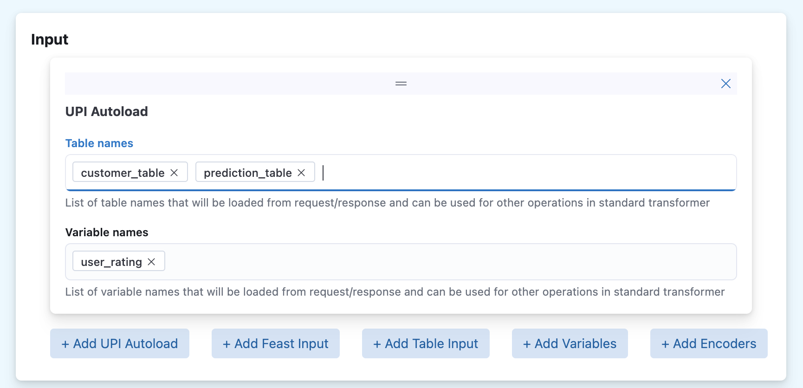
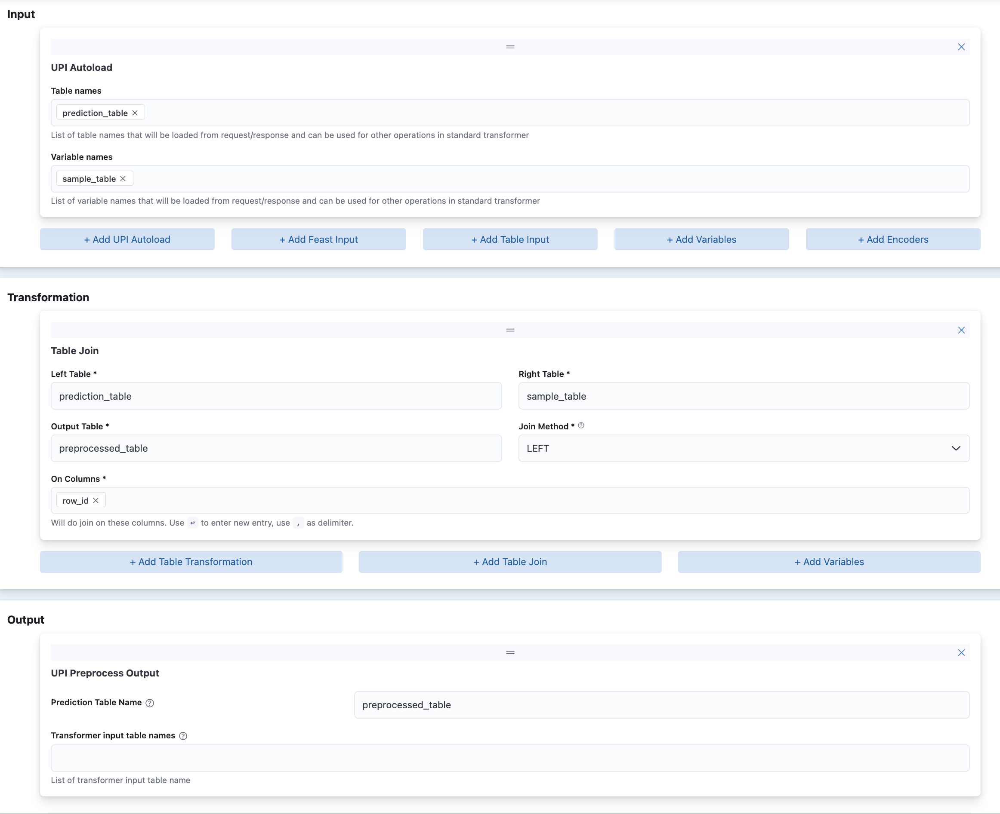

# Configuring Standard Transformer for UPI Model

> This guide assumes you have experience using standard transformer and  familiar with UPI contract. You can read refer to https://github.com/caraml-dev/universal-prediction-interface to get details on the contract. 

There are 2 key differences in Standard Transformer when it’s deployed using UPI protocol:

1. Autoload Feature
2. Separate Output Operation for Pre-process and Post-process

## Autoload Feature

Autoload feature is the primary mechanism for importing values in the request payload as variables or tables into standard transformer. Previously, it is done by using JSONPath query in the HTTP mode.

For example in HTTP model, if you want to declare a rating variable that should use value from user_rating field of the incoming request, then you have to declare following configuration in the input.

```yaml
  - variables:
      - name: rating
        jsonPathConfig: 
          jsonPath: $.user_rating
          defaultValue: -1
          valueType: INT
```

You can avoid it altogether by using autoload feature in UPI. To do so:

- Store the variable in `transformer_input` field of the `PredictValuesRequest` 

For example, when using Python SDK, you can do so by following code.

```python
from caraml.upi.v1 import type_pb2, upi_pb2_grpc, upi_pb2, variable_pb2

request = upi_pb2.`PredictValuesRequest`(
    ...
    transformer_input=upi_pb2.TransformerInput(
        variables=[
            variable_pb2.Variable(name="user_rating", 
                type=type_pb2.TYPE_DOUBLE, 
                double_value=5.0),
        ]
    )
    ...
)
```

- Add autoload feature in the standard transformer config.



Which will add following config

```
autoload:
  variableNames:
    - user_rating
```

Other than importing variables from `PredictValuesRequest`. The same mechanism can be used to import table in the request. The table created using UPI autoload will have additional column `row_id` which will store the row_ids value of the table associated table.


The imported tables and variables from UPI Autoload can then be used for downstream transformation in the standard transformer’s preprocess and post-process. 

## Preprocess & Postprocess Output

Standard transformer’s preprocessing output in UPI mode must satisfy `PredictValuesRequest` structure. You can  populate `prediction_table` field and tables in transformer_inputs fields of the `PredictValuesRequest` that will be sent  to model by defining its source tables. The source tables must be tables that have been declared in preprocessing pipeline.

Example below shows a preprocessing pipeline which join prediction_table and sample_table to produce preprocessed_table , and then use the preprocessed_table as the prediction_table of the `PredictValuesRequest` that is sent to model.



```yaml
transformerConfig:
  preprocess:
    inputs:
      - autoload:
          tableNames:
            - prediction_table
          variableNames:
            - sample_table
    transformations:
      - tableJoin:
          leftTable: prediction_table
          rightTable: sample_table
          outputTable: preprocessed_table
          how: LEFT
          onColumns:
            - row_id
    outputs:
      - upiPreprocessOutput:
          predictionTableName: preprocessed_table
          transformerInputTableNames: []
  postprocess: {}

```

Similarly, post-processing output in UPI mode must satisfy `PredictValuesResponse`. You can populate prediction_result_table of the `PredictValuesResponse` that will be sent back to client by defining its source table. The source table can be a table declared both in preprocessing and post-processing pipeline.

> When pre-processing or post-processing pipeline is not defined, standard transformer will simply forward the request/response to its receiver.
