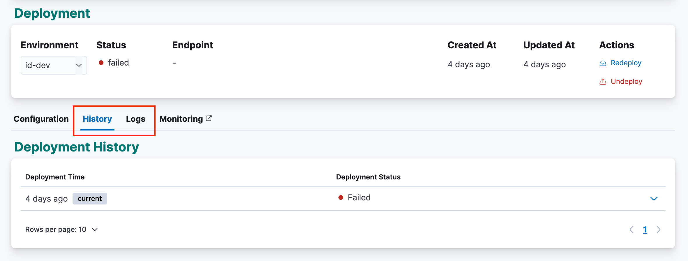
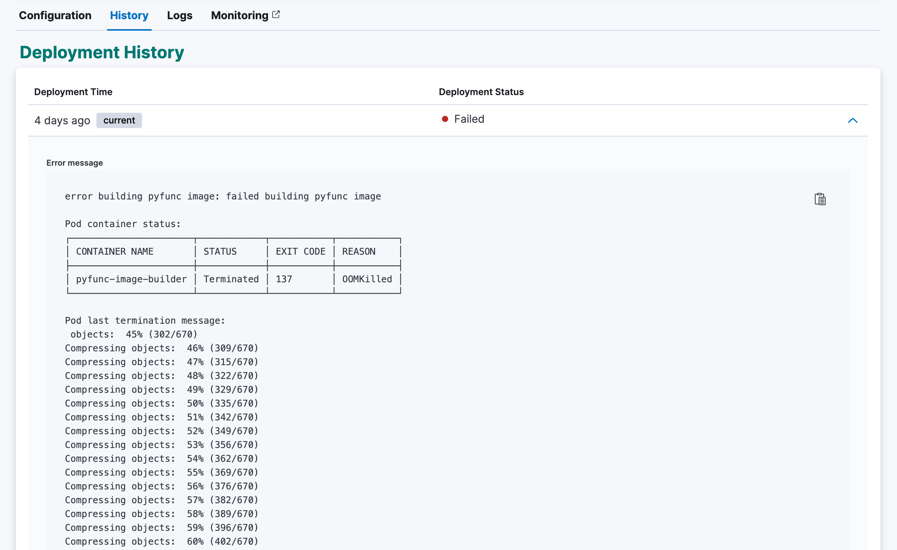
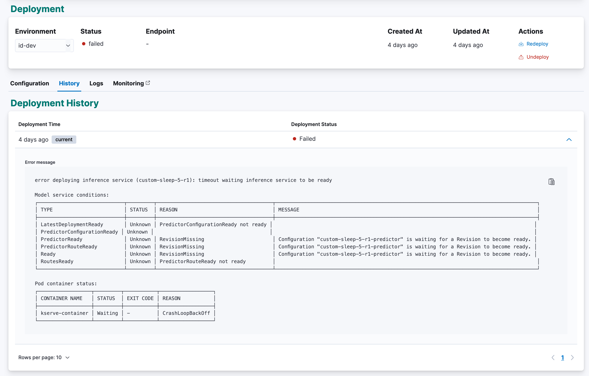
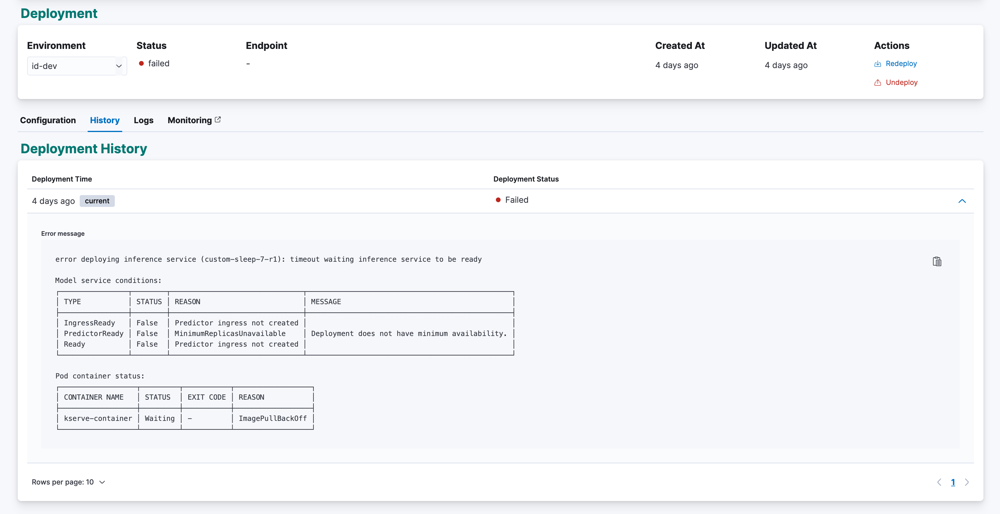

<!-- page-title: Troubleshooting Deployment Errors -->
<!-- parent-page-title: Deploying a Model -->

# Troubleshooting Deployment Errors

This page discusses scenarios you may encounter during model deployment that will require troubleshooting, including:

- Image building errors
- Deployment errors

## Troubleshooting views

Merlin provides the following views on the UI to troubeshoot a deployment:

- **Logs** - the live console output when the iamge is building or the deployment is running
- **History** - the list of deployment history status and message

You can navigate to these views from the Model Version page by clicking on the Logs tab or History tab.

## Known Errors

### OOMKilled

The "OOMKilled" error occurs when a container is terminated due to out-of-memory conditions. This typically happens when a container exceeds its allocated memory limit and the system is unable to provide additional memory. When this occurs, the container will be killed with exit code 137 to free up resources.

This error can effect both image building and deployment steps. To resolve the OOMKilled error, follow these steps:

1. Check which components that got OOMKilled
2. Check affected component memory limits
3. Monitor memory usage
4. Optimize model memory usage
5. Adjust memory limits

### Liveness or readiness probe failures

Liveness and readiness probes are essential for ensuring the health and availability of Model services. The liveness probe is used to determine if a model is initialized and running properly, while the readiness probe indicates if a model is ready to serve traffic. When these probes fail, it can lead to service disruptions and impact the overall stability of the application.

Troubleshooting steps:

1. For standard model type, check pre-trained model size
2. For pyfunc model type, check how model got initialized
3. Inspect model logs
4. Monitor resource utilization

### Image not found

The "Image Not Found" error occurs when Merlin is unable to locate the specified container image. This can happen for various reasons, such as the image not being available in the specified registry, incorrect image name, or network issues preventing the image pull.

To troubleshoot and resolve the "Image Not Found" error, follow these steps:

1. Verify image name and tag
2. Check image registry
3. Test image pull manually

