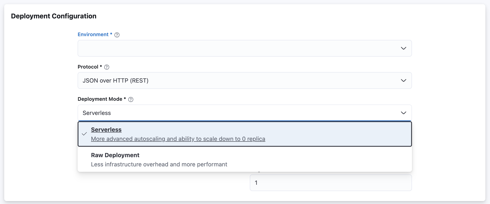

<!-- page-title: Deploying a Model Version -->
<!-- parent-page-title: Deploying a Model -->
# Model Version Endpoint

To start sending inference requests to a model version, it must first be deployed. During deployment, different configurations can be chosen such as the number of replicas, CPU/memory requests, autoscaling policy, environment variables, etc. The set of these configurations that are used to deploy a model version is called a *deployment*.

A model may have any number of versions. But, at any given time, only a maximum of **2** model versions can be deployed.

When a model version is deployed, a Model Version Endpoint is created. The URL is of the following format:

```
http://<model_name>-<version>.<project_name>.<merlin_base_url>
```

For example a Model named `my-model` within Project named `my-project` with the base domain `models.id.merlin.dev` will have a Model Version Endpoint for version `1` as follows:

```
http://my-model-1.my-project.models.id.merlin.dev
```

A Model Version Endpoint has several states:

- **pending**: The initial state of a Model Version Endpoint.
- **running**: Once deployed, a Model Version Endpoint is in running state and is accessible.
- **serving**: A Model Version Endpoint is in serving state if a Model Endpoint is created from it.
- **terminated**: Once undeployed, a Model Version Endpoint is in terminated state.
- **failed**: If an error occurred during deployment.

## Image Building

Depending on the type of the model being deployed, there may be an intermediate step to build the Docker image (using Kaniko). This is applicable to PyFunc models.


You can separately start the image building process without actually deploying your model by using `build_image()` function. For more details, you can check [Build Image](../12_build_image.md).


## Deploying a Model Version

A model version can be deployed via the SDK or the UI.

### Deploying a Model Version via SDK

Here's the example to deploy a Model Version Endpoint using Merlin Python SDK:


```python
with merlin.new_model_version() as v:
    merlin.log_metric("metric", 0.1)
    merlin.log_param("param", "value")
    merlin.set_tag("tag", "value")

    merlin.log_model(model_dir='tensorflow-sample')

    merlin.deploy(v, environment_name="staging")
```


### Deploying a Model Version via UI

The Deploy option can be selected from the model versions view.


## Deployment Modes

Merlin supports 2 types of deployment mode: `SERVERLESS` and `RAW_DEPLOYMENT`. Under the hood, `SERVERLESS` deployment uses KNative as the serving stack. On the other hand `RAW_DEPLOYMENT` uses native [Kubernetes deployment resources](https://kubernetes.io/docs/concepts/workloads/controllers/deployment/).

The deployment modes supported by Merlin have their own advantages and disadvantages, listed below.

* **Serverless Deployment:**
    - **Pros:** Supports more advanced autoscaling policy (RPS, Concurrency); supports scale down to zero.
    - **Cons:** Slower compared to `RAW_DEPLOYMENT` due to infrastructure overhead
* **Raw Deployment:**
    - **Pros:** Relatively faster compared to `SERVERLESS` deployments; less infrastructure overhead and more cost efficient.
    - **Cons:** Supports only autoscaling based on CPU usage.

### Configuring Deployment Modes

Users are able to configure the deployment mode of their model via the SDK or the UI.

#### Configuring Deployment Mode via SDK

Example below will configure the deployment mode to use `RAW_DEPLOYMENT`


```python
import merlin
from merlin import DeploymentMode
from merlin.model import ModelType

# Deploy using raw_deployment
merlin.set_url("merlin.example.com")
merlin.set_project("my-project")
merlin.set_model("my-model", ModelType.TENSORFLOW)
model_dir = "test/tensorflow-sample"

with merlin.new_model_version() as v:
    merlin.log_model(model_dir=model_dir)

# Deploy using raw_deployment
new_endpoint = merlin.deploy(v, deployment_mode=DeploymentMode.RAW_DEPLOYMENT)
```


#### Configuring Deployment Mode via UI



## Autoscaling Policy

Merlin supports configurable autoscaling policy to ensure that users have complete control over the autoscaling behavior of their models. There are 4 types of autoscaling metrics in Merlin:

* **CPU Utilization:** The autoscaling is based on the ration of model service's CPU usage and its CPU request. This autoscaling policy is available on all deployment mode.
* **Memory Utilization:** The autoscaling is based on the ration of model service's Memory usage and its Memory request. This autoscaling policy is available only on `SERVERLESS` deployment mode.
* **Model Throughput (RPS):** The autoscaling is based on RPS per replica of the model service. This autoscaling policy is available only on `SERVERLESS` deployment mode.
* **Concurrency:** The autoscaling is based on number of concurrent request served by a replica of the model service. This autoscaling policy is available only on `SERVERLESS` deployment mode.

### Configuring Autoscaling Policy

Users can update the autoscaling policy via the SDK or the UI.

#### Configuring Autoscaling Policy via SDK

Below is the example of configuring autoscaling policy of a `SERVERLESS` deployment to use `RPS` metrics.


```python
import merlin
from merlin import DeploymentMode
from merlin.model import ModelType

# Deploy using raw_deployment
merlin.set_url("merlin.example.com")
merlin.set_project("my-project")
merlin.set_model("my-model", ModelType.TENSORFLOW)
model_dir = "test/tensorflow-sample"

with merlin.new_model_version() as v:
    merlin.log_model(model_dir=model_dir)

# Deploy using raw_deployment
    endpoint = merlin.deploy(v1, deployment_mode=DeploymentMode.SERVERLESS,
                            autoscaling_policy=merlin.AutoscalingPolicy(
                                metrics_type=merlin.MetricsType.RPS,
                                target_value=20))
```


#### Configuring Autoscaling Policy via UI


## CPU Limits

By default, Merlin determines the CPU limits of all model deployments using platform-level configured values. These CPU 
limits can either be calculated as a factor of the user-defined CPU request value for each deployment (e.g. 2x of the 
CPU request value) or as a constant value across all deployments.

However, users can override this platform-level configured value by setting this value explicitly on the UI or on 
the SDK.

On the UI:


On the SDK:

```python
merlin.deploy(
    v,
    environment_name=some_name,
    resource_request=ResourceRequest(cpu_limit="2"),
    deployment_mode=some_deployment_mode,
)
```

## Liveness Probe

When deploying a model version, the model container will be built with a livenes probe by default. The liveness probe will periodically check that your model is still alive, and restart the pod automatically if it is deemed to be dead.

However, should you wish to disable this probe, you may do so by providing an environment variable to the model service with the following value:

```
MERLIN_DISABLE_LIVENESS_PROBE="true"
```

This can be supplied via the deploy function. i.e.


```python
    merlin.deploy(v, env_vars={"MERLIN_DISABLE_LIVENESS_PROBE"="true"})
```


The liveness probe is also available for the transformer. More details can be found at: 