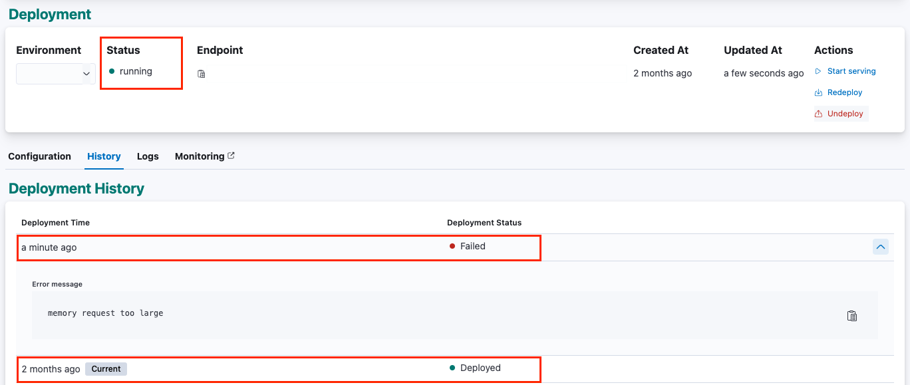
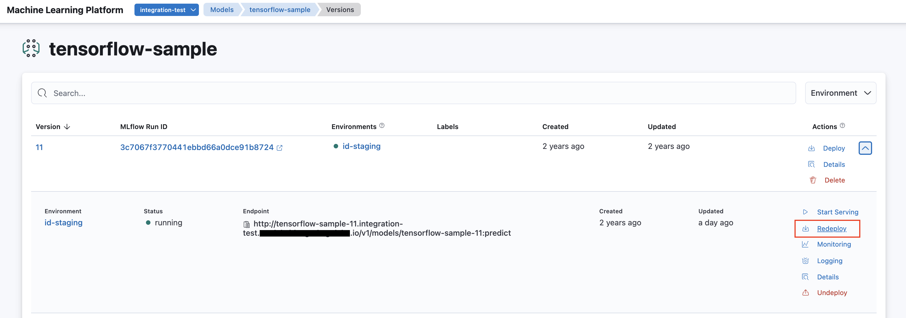

<!-- page-title: Redeploying a Model Version -->
<!-- parent-page-title: Deploying a Model -->
# Redeploying a Model Version

Once a model version is attempted to be deployed, a Model Version Endpoint is created. If the deployment is successful, the endpoint would be in the Running state. This endpoint can later also be terminated.

Whenever a running (or serving) model version is redeployed, a new *deployment* is created and the Merlin API server attempts to deploy it, while keep the existing deployment running (or serving). 

If the deployment of the new configuration fails, **the old deployment stays deployed** and remains as the current *deployment* of the model version. The new configuration will then show a 'Failed' status.



A model version can be redeployed via the SDK or the UI.

### Redeploying a Model Version via SDK


```python
import merlin
from merlin import DeploymentMode

# Get model version that's already deployed
merlin.set_url("merlin.example.com")
merlin.set_project("my-project")
merlin.set_model("my-model")
model = merlin.active_model()
version = model.get_version(2)

# Redeploy using new config (here, we are updating the deployment mode)
new_endpoint = merlin.deploy(v, deployment_mode=DeploymentMode.RAW_DEPLOYMENT)
```


### Redeploying a Model Version via UI

A Running / Serving model version can be redeployed from the model versions view.

