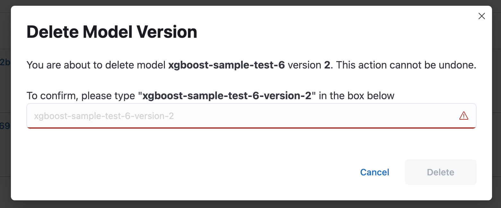
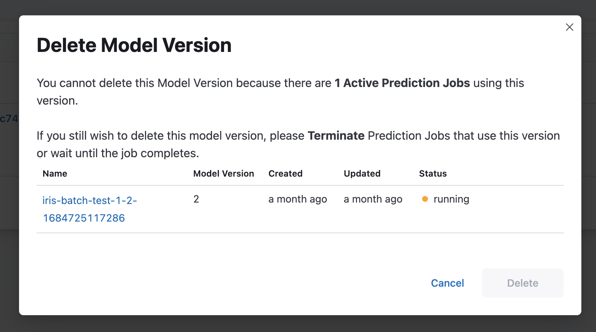
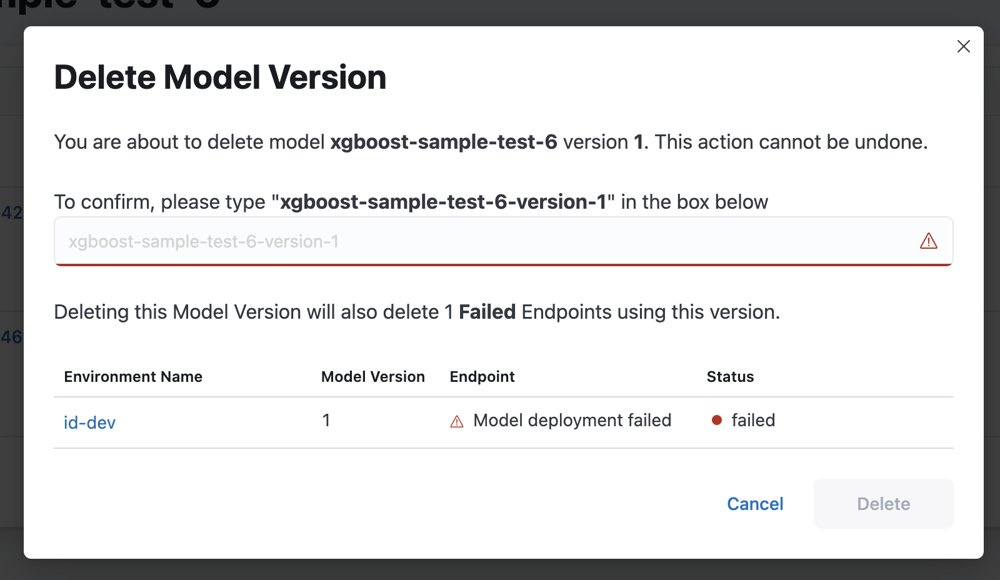

# Model Version Deletion

A Merlin model version can be deleted only if it is not serving any endpoints and does not have any deployed 
endpoints or, if the base model is of the `pyfunc_v2` type, the model version must not have any active prediction jobs. 
Deleting a model version will result in the purging of the model version and its related entities, such as endpoints or 
prediction jobs, from the Merlin database. This action is **irreversible**.

Model versions with related active prediction jobs or endpoints can not be deleted.

## Model Version Deletion Via the SDK
To delete a Model Version, you can call the `delete_model_version()` function from Merlin Python SDK.

```python
merlin.set_project("test-project")

merlin.set_model('test-model')

version = merlin.active_model().get_version(id_version)

version.delete_model_version()
```


## Model Version Deletion via the UI
To delete a model version from the UI, you can access the delete button directly on the model version list page. The dialog will provide information about entities that are blocking the deletion process or will be deleted along with the model version.

- If the model version does not have any associated entities, a dialog like the one below will be displayed:


- If the model version has any associated active entities, a dialog like the one below (showing the entities blocking the deletion process) will be displayed:


- If the model version has any associated inactive entities, a dialog like the one below (showing which entities will get deleted along with the deletion process) will be displayed:

