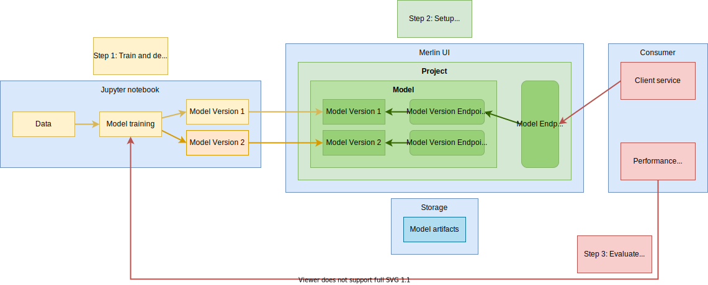

<!-- page-title: Introduction to Merlin -->
# Merlin

After you have built a model with high-quality training data and the perfect algorithm, it’s time to apply it to make predictions and serve the outcome for future decision making.
For many data scientists, model training can be done easily within their Jupyter notebook. However, things become trickier when it comes to productionizing the model to serve real traffic, which is engineering intensive. There are many tools available, but learning when and how to use them requires a lot of exploration, which can be a headache.

## What is Merlin

Merlin is a platform designed to help users productionize their models quickly without deep knowledge on MLOps. Users only need to deploy their model into Merlin, and it will take care of the traffic routing and resources scaling in the background, saving lots of engineering hours and expertise required otherwise.

## User Flows

Productionizing a model with Merlin can be easily done in 3 steps, as detailed in the diagram below:

1. **Deploy a model**

    We want to make the deployment experience as seamless as possible, directly from Jupyter notebook. With the Merlin SDK, we can now upload the model and trigger the deployment pipeline, by simply calling a few functions in the notebook. Alternatively, Merlin UI supports the same, with just 1 click.

2. **Setup serving endpoint**

    Once the model is deployed with an auto-generated HTTP endpoint, you can then specify the serving model version in the console. Give it a minute and your model will automagically be able to serve prediction.

3. **Evaluate and iterate**

    The Merlin UI allows you to deploy and track different model versions and tag any version to run experiment easily. All model artifacts are synchronized into MLflow Tracking, which can be used to track and compare the model performance.

## Key Concepts of Merlin

The design of Merlin uses a few key concepts below, you should familiarize yourself with:

**Project**: Project represents a namespace for a collection of model. For example, a project could be food Recommendations, driver allocation, ride pricing, etc.

**Model**: Every model is associated with one (and only one) project and model endpoint. Model also can have zero or more model versions. In the entities' hierarchy of MLflow, a model corresponds to an MLflow experiment.

**Model Version**: The model version represents an iteration within a model. A model version is associated with a run within MLflow. A Model Version can be deployed as a service, there can be multiple deployments of model version with different endpoint each.

**Model Endpoint**: Every model has its own endpoint that contains routing rule(s) to an active model version endpoint (serving mode). This endpoint is usually used to serve traffic in production. The model version it is routed to changes in the background when a serving model version is changed. Hence there is no need to change the endpoint used to serve traffics when the serving model version is changed.

**Model Version Endpoint**: A model version endpoint is a way to obtain model inference results in real-time, over the network (HTTP). This endpoint is unique to each model version. Model endpoint will route to the model version endpoint in the background, when the associated model version is set to serving.

**Environment**: The environment’s name is a user-facing property that will be used to determine the target Kubernetes cluster where a model will be deployed to. The environment has two important properties, name and Kubernetes cluster.