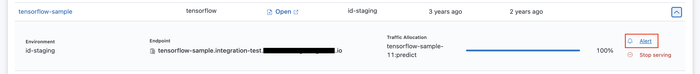
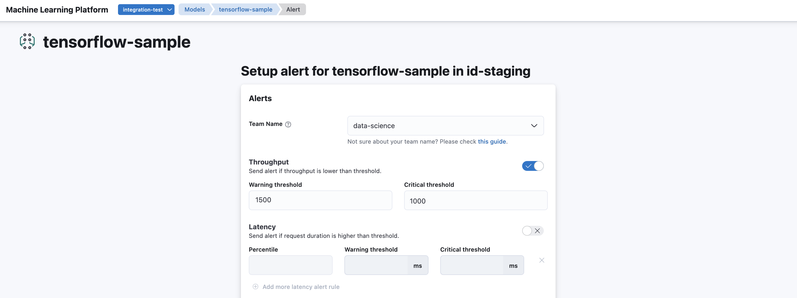

<!-- page-title: Configuring Alerts on Models -->
# Configuring Alerts


This feature is currently behind a toggle and may or may not be enabled on the Merlin controller, by the maintainers.


Merlin uses a GitOps based alerting mechanism. Alerts can be configured for a model, on the Model Endpoint (i.e., for the model version that is in the 'Serving' state), from the models list UI.

## Metrics

Alerting based on the following metrics are supported. For all metrics below, the transformer metrics, if exists, will also be taken into account.
* **Throughput:** This alert is triggered when the number of requests per second received by the model is lower than the threshold.
* **Latency:** This alert is triggered when the latency of model response time is higher than the threshold. 
* **Error Rate:** This alert is triggerred when the percentage of erroneous responses from the model is more than the threshold.
* **CPU:** This alert is triggered when the percentage of CPU utilization is more than the threshold.
* **Memory:** This alert is triggered when the percentage of memory utilization is more than the threshold.

