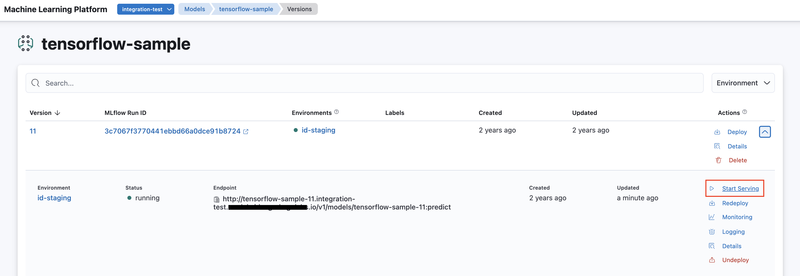

<!-- page-title: Serving a Model Version -->
<!-- parent-page-title: Deploying a Model -->
# Model Endpoint

Model serving is the next step of model deployment. After deploying a model version, we can optionally start serving it. This creates a Model Endpoint which is a stable URL associated with a model, of the following format:

```
http://<model_name>.<project_name>.<merlin_base_url>
```

For example a Model named `my-model` within Project named `my-project` with the base domain `{{ models_base_domain }}` will have a Model Endpoint which look as follows:

```
http://my-model.my-project.{{ models_base_domain }}
```

Having a Model Endpoint makes it easy to keep updating the model (creating a new model version, running it and then serving it) without having to modify the model URL used by the called system.

## Serving a Model Version

A model version can be served via the SDK or the UI.

### Serving a Model Version via SDK

To serve a model version, you can call `serve_traffic()` function from Merlin Python SDK.


```python
with merlin.new_model_version() as v:
    merlin.log_metric("metric", 0.1)
    merlin.log_param("param", "value")
    merlin.set_tag("tag", "value")

    merlin.log_model(model_dir='tensorflow-sample')

    version_endpoint = merlin.deploy(v, environment_name="staging")

# serve 100% traffic at endpoint
model_endpoint = merlin.serve_traffic({version_endpoint: 100})
```


### Serving a Model Version via UI

Once a model version is deployed (i.e., it is in the Running state), the Serve option can be selected from the model versions view.

