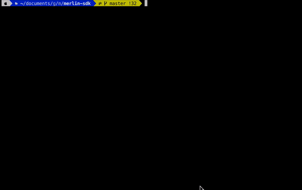

# Merlin SDK

This project contains python library for interacting with Merlin, machine
learning model serving component of CaraML.
It provides interface to:

- Manage ML project resources
- Track metrics and training performance
- Package and Deploy Model

## Installation

```shell script
pip install merlin-sdk
```

and authenticate to gcloud

```bash
gcloud auth application-default login
```

## Getting Started

The easiest way to get started is to explore example notebook:

1. [Deploying xgboost model](../../examples/xgboost/XGBoost.ipynb)
2. [Deploying sklearn model](../../examples/sklearn/SKLearn.ipynb)
3. [Deploying tensorflow model](../../examples/tensorflow/Tensorflow.ipynb)
4. [Deploying pytorch model](../../examples/pytorch/Pytorch.ipynb)
5. [Deploying user defined model](../../examples/pyfunc/Pyfunc.ipynb)

# Development

Requirements:

- pipenv (`pip install pipenv`)
- swagger code gen (`brew install swagger-codegen`)

Setup development environment:

```bash
make setup
```

## Merlin CLI

With the CLI, users can deploy a trained model (serialized model) without touching Python code at all.



To use the CLI:

```
// to see available subcommands
merlin --help

// to see subcommand options
merlin SUBCOMMAND --help

// deploy existing xgboost model located inside cur_model_dir
merlin deploy --url localhost --model-type xgboost --project sample --model-dir cur_model_dir --model-name xgboost-sample --env staging

// undeploy xgboost-sample version 1
merlin undeploy --url localhost --project sample --model-name xgboost-sample --model-version=1

// generate pyfunc code base
merlin scaffold -p merlin-project -m model-name -e id
```
