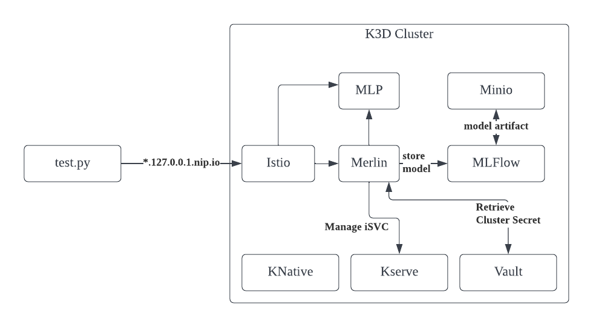

# Merlin End to end test

## Software Requirements

You need following softwares to execute merlin end to end test locally:

- kubectl
- helm 3
- k3d
- yq
- jq


## Steps

To run E2E test locally you can execute

```
./setup-and-run-e2e.sh
```

The script will perform following processes:

1. Create K3D cluster and a managed docker registry
2. Install all infrastructure dependencies (e.g. Istio, Knative, Vault, Kserve, Minio)
3. Build docker image of all Merlin components
4. Import all the docker images to the k3d managed docker registry
5. Deploy MLP and Merlin
6. Run End to end test

Following is the visualization of the end to end test setup


Some notes about the end to end test setup:

1. 127.0.0.nip.io is used as ingress host so that we don't need to modify etc/hosts. See https://nip.io/ for more details
2. Minio is used as the object storage
3. In order for internal pods to access istio, the K3D core dns configuration is modified (see [patch](config/coredns/patch.yaml)).

```
rewrite name regex (.*)\.127\.0\.0\.1\.nip\.io istio-ingressgateway.istio-system.svc.cluster.local
```
